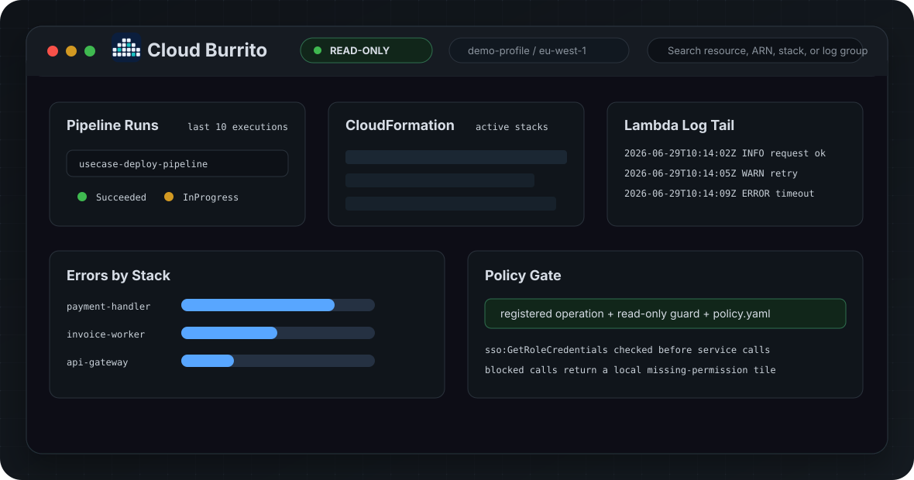

<p align="center">
  
</p>

<h1 align="center">Cloud Burrito</h1>

<p align="center">
  A fast, <strong>read-only</strong> desktop dashboard for browsing AWS across multiple accounts — built in pure Rust.
</p>

<p align="center">
  
  
  
  
  
</p>

<p align="center">
  
</p>

---

Cloud Burrito is a small native desktop app for engineers who want a quick,
**safe** window into their AWS estate — pipeline runs, CloudFormation stacks, log
tails, error aggregates — without the risk of fat-fingering a destructive action.

It is **read-only by construction**: the binary has a closed registry of AWS
operations, every request path passes a structural read-only guard, and
`policy.yaml` must explicitly allow the operation before the SDK call is issued.
Admin credentials do not give the app a generic "run any AWS call" escape hatch.

No Python, no Node, no sidecar process, no runtime dependencies — just one
compiled binary that talks to AWS in-process via the AWS SDK for Rust.

## Contents

- [Highlights](#highlights)
- [Security model](#security-model)
- [Widgets](#widgets)
- [Getting started](#getting-started)
- [Configuration](#configuration)
- [Architecture](#architecture)
- [Project layout](#project-layout)
- [Development](#development)
- [Release pipeline](#release-pipeline)
- [License](#license)

## Highlights

- **Read-only, guaranteed.** Write operations aren't in the binary. Admin
  credentials grant the app no powers it doesn't have code for.
- **User-narrowable policy.** An IAM-style `policy.yaml` allowlist (edited from
  the Settings panel, with live YAML syntax highlighting) further restricts which
  read operations may run — and can only narrow, never widen.
- **Full audit trail.** Every allowed or blocked AWS call preflight is appended
  to a JSONL audit log and shown live in an in-app Audit panel, tagged `aws`,
  `aws-blocked`, or lifecycle.
- **Multi-account via AWS SSO.** Uses your existing `~/.aws/config` SSO profiles;
  set a default account/region from the top bar, or pin account/region per widget.
- **Customizable dashboard.** Drag/resize widget tiles (GridStack); the layout
  and per-tile config persist across launches.
- **Single binary.** Pure Rust + a webview UI. No interpreter, no helper process.
- **Offline demo mode.** Open the frontend in a plain browser to explore the UI
  with mock data — no AWS account required.

## Security model

The read-only guarantee is enforced as a hierarchy. Every gate must pass before
the app issues an AWS SDK request; any failure stops the call locally:

```
  requested AWS operation
            │
            ▼
  1. Compiled registry
     Is this exact service:Operation built into the app?
            │ yes
            ▼
  2. Structural read-only guard
     Is the operation classified as read-only / non-mutating?
            │ yes
            ▼
  3. policy.yaml
     explicit Deny > matching Allow > default-deny
            │ yes
            ▼
  AWS SDK request is issued
```

1. **Compiled registry.** Only operations listed in `src-tauri/src/aws/policy.rs`
   can run. Wildcards in `policy.yaml` never add new capabilities; they only
   match this closed set.
2. **Structural read-only guard.** The operation name must pass the local
   read-only classifier. This blocks mutating verbs even if someone adds them to
   `policy.yaml` by mistake.
3. **`policy.yaml` allowlist.** A familiar IAM-statement-style file you control:

   ```yaml
   # ~/.cloud_burrito/policy.yaml
   statements:
     - effect: Allow
       action:
         - sso:GetRoleCredentials
         - sts:GetCallerIdentity
         - cloudformation:Describe*
         - cloudformation:List*
         - logs:*
         - codepipeline:Get*
         - codepipeline:List*
         - codeartifact:Describe*
         - codeartifact:List*
     - effect: Deny          # explicit Deny always wins
       action:
         - logs:StartQuery
   ```

   Globs (`*`, `?`) are supported; anything not matched by an `Allow` is denied.
   The file is **fail-closed** — invalid YAML denies everything rather than
   falling back to permissive — and is auto-seeded on first run with exactly the
   operations the app uses, so it works out of the box and you delete lines to
   scope down. Remove a service and the corresponding widget shows a clear
   "missing permission" tile instead of making the call.

SSO credential resolution is part of the hierarchy too. The AWS SDK can refresh
role credentials before a service call, so every service-call path also requires
`sso:GetRoleCredentials` to be allowed before the service request can proceed.
If you remove that action from `policy.yaml`, set-account and later widget
refreshes stop locally before a service call is issued.

Current compiled registry:

```text
sso:GetRoleCredentials
sts:GetCallerIdentity
cloudformation:ListStacks
cloudformation:DescribeStackResources
cloudformation:DescribeStackEvents
logs:DescribeLogGroups
logs:StartQuery
logs:GetQueryResults
logs:StopQuery
logs:FilterLogEvents
codepipeline:ListPipelines
codepipeline:ListPipelineExecutions
codepipeline:ListActionExecutions
codebuild:BatchGetBuilds
codeartifact:ListPackages
codeartifact:ListPackageVersions
codeartifact:DescribePackageVersion
lambda:ListFunctions
logs:GetLogEvents
logs:DescribeLogStreams
resourcegroupstaggingapi:GetResources
```

> Note: this is a client-side safety rail, not a substitute for least-privilege
> IAM. Always pair it with a read-only role.

### The AWS CLI Table widget and the registry

The `aws-cli` widget runs a user-supplied read-only `aws` command, which by
nature cannot be pre-registered. For that one path the compiled registry gate is
replaced by the structural read-only guard as the floor: the command's
`service:Operation` (derived from the CLI names, e.g. `ec2 describe-instances`
→ `ec2:DescribeInstances`) must pass the read-only classifier **and** be
allowed by `policy.yaml`. Because the auto-seeded policy only lists registry
operations, every CLI action outside the registry is **deny-by-default** — you
opt in per service by adding a line such as `- ec2:Describe*` in Settings. The
command is tokenized and spawned as an argument vector (never a shell),
`--profile`/`--output` are rejected, and the child runs under the tile's
account context via `AWS_PROFILE`/`AWS_REGION`. Every run and every denial is
audited like SDK calls. Like pipelines, commands can be pinned: each pin saves
the command together with the profile/account/region it was created under and
always reruns in that context, side by side on the widget's Pinned tab.

## Widgets

The dashboard widgets are compiled into the binary, with drill-down views for
stack details, pipeline execution details, and CodeBuild logs:

| Widget | What it shows |
| --- | --- |
| `cfn-stacks` | CloudFormation stacks in the active region with status and resource count |
| `log-tail` | Lambda function browser with ARN/update/log-group details, log streams, and events |
| `cloudwatch-logs` | Search CloudWatch log groups, browse their streams, and view events |
| `errors-by-stack` | CloudWatch errors grouped by stack over a selected time window, with in-widget filtering |
| `resource-lookup` | Reverse-lookup: find the CloudFormation stack that owns a resource |
| `pipeline-runs` | Recent CodePipeline executions with expandable detail, plus pinned pipelines across accounts and regions |
| `codeartifact-packages` | Latest package versions in CodeArtifact filtered by package prefix |
| `logs-insights` | Your own CloudWatch Logs Insights query against any log group, rendered as a table |
| `aws-cli` | A read-only `aws` CLI command run under the tile's account context, JSON output rendered as a table |

Widget payloads may use stable machine keys such as `latest_version`,
`last_published`, or `execution_id`, but the UI must not show those raw names as
labels. Subtitles, action labels, empty states, and permission messages should
also read like product copy rather than internal API fields. User-facing values
should be formatted for reading too: ISO timestamps render as compact local
times, status constants render as words, and booleans render as Yes/No. Exact
identifiers and names, such as execution IDs, ARNs, pipeline names, log groups,
package versions, and repository names, should stay unchanged. The frontend
formats display labels centrally: separators become spaces, words become title
case, and known cloud acronyms such as AWS, CFN, ID, ARN, SSO, URL, JSON, and
YAML stay uppercase. New widgets should return stable keys and let the UI naming
rule render readable labels and values.

## Getting started

### Prerequisites

- **Rust** 1.77+ and Cargo
- **Tauri CLI v2** — `cargo install tauri-cli@^2 --locked`
- **AWS CLI v2** with at least one **SSO** profile configured in `~/.aws/config`
  (`aws configure sso`), and a valid session (`aws sso login`)
- A system webview (preinstalled on macOS)

### Run

```bash
git clone <repository-url>
cd cloud-burrito
./scripts/dev.sh          # runs `cargo tauri dev` from src-tauri/
```

### Build a release bundle

```bash
cd src-tauri
cargo tauri build         # produces a .app and .dmg (macOS)
```

Automated releases are published by GitHub Actions from `app-vX.Y.Z` tags; see
[Release pipeline](#release-pipeline).

## Configuration

Pick your default account and region in the top bar, and set your SSO session in
the Settings panel. Individual widgets can inherit the default or pin their own
account/region.
State lives in your home directory:

| Path | Purpose |
| --- | --- |
| `~/.aws/config` | Your AWS SSO profiles (standard AWS CLI config) |
| `~/.cloud_burrito/settings.json` | App settings (config path, SSO session, default profile/region) |
| `~/.cloud_burrito/policy.yaml` | Read-only allowlist (see [Security model](#security-model)) |
| `~/.cloud_burrito/dashboard.json` | Saved dashboard layout and per-tile config |
| `~/.cloud_burrito/audit.log` | Append-only JSONL log of AWS call preflights and blocked calls |

Authentication uses the standard SSO flow: `aws-config` resolves your profile's
cached SSO token into short-lived role credentials that the SDK auto-refreshes.
When the token expires, the app detects it and prompts you to re-run
`aws sso login`. The default region is `eu-west-1` (allowed regions are
`eu-west-1` and `us-east-1`, adjustable in `src-tauri/src/settings.rs`).

## Architecture

A [Tauri 2](https://tauri.app) application: a Rust backend that does all the work,
and an HTML/CSS/JS dashboard rendered in the OS webview.

- **`src-tauri/` (Rust)** — every AWS call (via `aws-sdk-*` + `aws-config`), the
  read-only policy and structural guard, the audit log, credential/SSO handling,
  and settings/dashboard persistence. The UI reaches it through `#[tauri::command]`
  handlers — there is no separate sidecar process or RPC bridge.
- **`frontend/` (vanilla JS, no build step)** — renders the dashboard, handles
  layout and the settings/policy editor, and calls the backend via `invoke(...)`.
  Opened directly in a browser, it falls back to mock data for an offline preview.

## Project layout

```
frontend/    Vanilla HTML/CSS/JS dashboard (open index.html for the offline demo)
src-tauri/   Tauri 2 (Rust) app — all AWS calls happen in-process
  src/aws/   Credentials/SSO context, config parsing, read-only guard + policy
  src/widgets/  The compiled-in widgets
scripts/     dev.sh (cargo tauri dev wrapper)
info/        Design spec, architecture notes, status page
docs/        Project docs / specs / plans
```

## Development

```bash
cd src-tauri
cargo test -p cloud-burrito             # unit tests
cargo clippy -p cloud-burrito -- -D warnings
```

The frontend has no build step; edit `frontend/*.js`/`*.css` and reload.

### Local security check

```bash
./scripts/security-check.sh
```

Run this before publishing or tagging. It runs the release metadata and privacy
gates, scans any non-ignored untracked files, syntax checks the local scripts and
frontend files, checks whitespace, and uses optional local scanners such as
gitleaks, detect-secrets, and trufflehog when they are already installed. The
built-in privacy gate scans for AWS keys, credential assignments, private keys,
account IDs, absolute local user paths, and hashed denylist values for
project-private markers. Matched values are redacted in its output. Gitleaks is
configured to ignore generated/build artifacts that are already excluded from
Git. Detect-Secrets runs with `--no-verify`, and TruffleHog runs with
`--no-update --no-verification`, so local checks do not contact live services.

## Release pipeline

Cloud Burrito releases are tag-driven. The tag must match both app manifests:

```bash
python3 scripts/check-release-version.py app-v0.2.2
git tag app-v0.2.2
git push origin app-v0.2.2
```

The pipeline has two workflows:

| Workflow | Trigger | What it does |
| --- | --- | --- |
| `CI` | PRs and pushes to `dev`/`main` | Checks version metadata, runs the release privacy scan, syntax-checks frontend JS, runs Rust tests, runs Clippy, and checks whitespace |
| `Release` | `app-v*` tags or manual dispatch with a tag | Re-runs all CI gates, builds macOS Apple Silicon and Intel bundles, scans the built `.app`, uploads `.app.zip`, `.dmg`, and SHA-256 files, then creates a draft GitHub release |

Release privacy is a hard gate. `scripts/check-release-privacy.py` scans tracked
source files and the packaged app bundle for AWS access key IDs, credential
assignments, private keys, standalone 12-digit account IDs, local absolute user
paths, and hashed denylist values for project-private markers. The workflows also
assert that AWS credential environment variables are empty before any job runs.

No AWS credentials or AWS API calls are used anywhere in CI or release. The
current release workflow produces unsigned macOS bundles; public notarized
distribution can be added later with Apple signing credentials stored only as
GitHub environment secrets on the protected `release` environment.

## License

[MIT](LICENSE) © Cloud Burrito contributors
