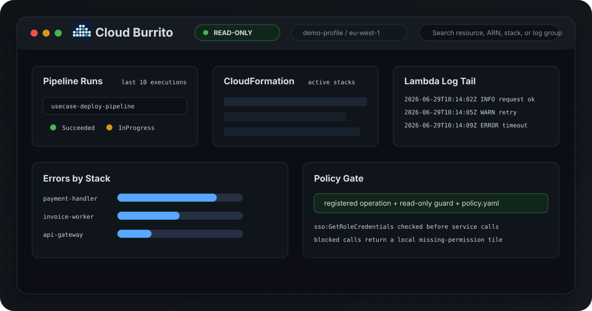

<p align="center">
  
</p>

<h1 align="center">Cloud Burrito</h1>

<p align="center">
  A fast, <strong>read-only</strong> desktop dashboard for browsing AWS across multiple accounts — built in pure Rust.
</p>

<p align="center">
  
  
  
  
  
</p>

<p align="center">
  
</p>

---

Cloud Burrito is a small native desktop app for engineers who want a quick,
**safe** window into their AWS estate — pipeline runs, CloudFormation stacks, log
tails, error aggregates — without the risk of fat-fingering a destructive action.

The binary has a **closed operation registry**: resource reads, Logs Insights
query control and credential acquisition have distinct classifications.
`policy.yaml` can restrict these capabilities; even a wildcard allow cannot
enable an operation outside that registry. Queries can incur AWS charges.

The core uses the AWS SDK for Rust in-process, without Python or Node at runtime.
The optional AWS CLI Table widget requires a separately installed AWS CLI v2.

## Contents

- [Highlights](#highlights)
- [Security model](#security-model)
- [Widgets](#widgets)
- [Getting started](#getting-started)
- [Configuration](#configuration)
- [Architecture](#architecture)
- [Project layout](#project-layout)
- [Development](#development)
- [Release pipeline](#release-pipeline)
- [Contributing and security](#contributing-and-security)
- [License](#license)

## Highlights

- **Exact operation boundaries.** Only reviewed operations can pass the local
  gate; query control and credentials are distinct from resource reads.
- **User-narrowable policy.** An IAM-style `policy.yaml` allowlist (edited from
  the Settings panel, with live YAML syntax highlighting) further restricts which
  supported operations may run — and cannot expand the compiled registry.
- **Local activity diagnostics.** Correlated application outcomes and capability
  preflights appear in the Audit panel. They are not SDK wire-call counts. Failed
  audit writes show a visible warning; raw inputs and error payloads are excluded.
- **Multi-account via AWS SSO.** Uses your existing `~/.aws/config` SSO profiles;
  search for a default account/region from the top bar, or pin account/region per widget.
- **Customizable dashboard.** Drag/resize widget tiles (GridStack); the layout
  and per-tile config persist across launches.
- **Native core.** Rust + a webview UI; AWS CLI is optional for the CLI widget.
- **Offline demo mode.** Open the frontend in a plain browser to explore the UI
  with mock data — no AWS account required.

## Security model

Application-requested operations pass the following local checks. These gates
do not intercept every internal action of the SDK credential provider:

```
  requested AWS operation
            │
            ▼
  1. Compiled registry
     Is this exact service:Operation built into the app?
            │ yes
            ▼
  2. Supported execution path
     SDK capability, or reviewed CLI read + validated arguments?
            │ yes
            ▼
  3. policy.yaml
     explicit Deny > matching Allow > default-deny
            │ yes
            ▼
  SDK call or CLI child may proceed
```

1. **Compiled registry.** Exact records in `src-tauri/src/aws/guard.rs` define
   18 resource reads, two query-control operations and one credential operation.
   Operation prefixes such as `Get` or `Batch` grant no authority. Application
   action names are not a ready-to-attach IAM policy.
2. **Execution path.** CLI names have explicit mappings and per-command argument
   rules. Credential acquisition and query start/stop are excluded from the CLI
   table. SDK query workflows require both `logs:StartQuery` and `logs:StopQuery`
   in the local policy before starting; this does not guarantee AWS IAM grants
   cleanup permission or that remote cleanup succeeds.
3. **`policy.yaml` allowlist.** A familiar IAM-statement-style file you control:

   ```yaml
   # ~/.cloud_burrito/policy.yaml
   statements:
     - effect: Allow
       action:
         - sso:GetRoleCredentials
         - sts:GetCallerIdentity
         - cloudformation:Describe*
         - cloudformation:List*
         - logs:*
         - codepipeline:Get*
         - codepipeline:List*
         - codeartifact:Describe*
         - codeartifact:List*
     - effect: Deny          # explicit Deny always wins
       action:
         - logs:StartQuery
   ```

   Globs (`*`, `?`) are supported; anything not matched by an `Allow` is denied.
   The file is **fail-closed** — invalid YAML denies everything rather than
   falling back to permissive — and is auto-seeded on first run with exactly the
   operations the app uses, so it works out of the box and you delete lines to
   scope down. Remove a service and the corresponding widget shows a clear
   "request blocked" tile instead of making the call.

Service-call paths also require `sso:GetRoleCredentials` in the local policy.
This is a credential preflight, not evidence that a request reached AWS.
The app resolves only the selected SSO profile, verifies its account and principal
with STS, and supplies the same fixed, expiring credentials to resource clients.
Renewed credentials must be verified again. Credential and endpoint settings do
not fall back to the environment or the default SDK provider chain. Named SSO
sessions can still renew their cached token through the SDK's OIDC provider;
these provider-internal requests are not individually represented in the local
operation registry. See the [P1-03 evidence](docs/roadmap/p1-03-evidence.md).

Current compiled registry:

```text
sso:GetRoleCredentials
sts:GetCallerIdentity
cloudformation:ListStacks
cloudformation:DescribeStackResources
cloudformation:DescribeStackEvents
logs:DescribeLogGroups
logs:StartQuery
logs:GetQueryResults
logs:StopQuery
logs:FilterLogEvents
codepipeline:ListPipelines
codepipeline:ListPipelineExecutions
codepipeline:ListActionExecutions
codebuild:BatchGetBuilds
codeartifact:ListPackages
codeartifact:ListPackageVersions
codeartifact:DescribePackageVersion
lambda:ListFunctions
logs:GetLogEvents
logs:DescribeLogStreams
resourcegroupstaggingapi:GetResources
```

> Note: this is a client-side safety rail, not a substitute for least-privilege
> IAM. Always pair it with a read-only role.

### The AWS CLI Table widget and the registry

CLI execution uses the same temporary credentials already verified for the
selected connection. Pinned accounts are verified independently. Credentials go
only into the child environment, never command arguments or a credentials file.

The CLI parser recognizes the **18 resource-read operations** above
through exact CLI mappings, including `sts get-caller-identity`, `cloudformation
list-stacks` and `codebuild batch-get-builds`. Each has a reviewed argument
schema. Unknown, abbreviated or repeated switches, file-loading values,
unreviewed structured inputs, and context/endpoint/output overrides are rejected
before process execution. A recognized request still needs a policy allow and a
verified connection with unexpired temporary credentials.

Examples:

```text
aws cloudformation list-stacks
aws cloudformation describe-stack-resources --stack-name demo-stack
aws codepipeline list-pipeline-executions --pipeline-name demo-pipeline
```

**Compatibility change:** EC2, S3 and other commands outside this finite list
cannot be enabled by adding policy wildcards. Existing pins are preserved, but
unsupported commands show a rejection when run. Query start/stop and credential
issuance must use their dedicated application workflows.

Parsed commands become an argument vector, never a shell command. The runner
resolves an absolute executable, clears the inherited environment and uses an
isolated temporary home and working directory. Personal CLI aliases, models and
configuration are not loaded. Native installers and Unix wrappers with an
absolute Python interpreter are supported; the latter run Python in isolated
mode, including Homebrew's current wrapper form. Shell, batch and PATH-based
interpreter wrappers are rejected. A trusted CLI v2 installation is required;
executable inspection does not verify its version or publisher.

The child has a 30-second deadline, shortened when credentials expire sooner.
Output is capped while reading: 2 MiB for stdout and 256 KiB for stderr.
Cancellation, context invalidation, timeout and overflow request termination and
await the direct child's exit; OS cleanup can take longer than the execution
deadline. Raw child diagnostics are withheld from the UI. Native executable
discovery and process behavior still require validation on each platform.

See the [P1-02 evidence](docs/roadmap/p1-02-evidence.md) for the parser contract and
[P1-04 evidence](docs/roadmap/p1-04-evidence.md) for the environment contract,
supervision checks and remaining native acceptance. [P1-05](docs/roadmap/p1-05-evidence.md)
adds result ownership; [P1-06](docs/roadmap/p1-06-evidence.md) records bounded IPC inputs,
safe console links, redacted diagnostics and audit outcomes. P1 is complete locally;
live AWS, installer and native-platform acceptance remain pending.

## Widgets

The dashboard widgets are compiled into the binary, with drill-down views for
stack details, pipeline execution details, and CodeBuild logs:

Results identify their verified account/region and when the displayed evidence
was received. A same-context refresh failure can retain earlier evidence
with its original time and a stale label. Changing the inherited connection
clears its old results while the new identity is verified.

Coverage notices describe loaded pages, requested limits and failed subrequests.
An empty limited result does not establish that no matching resource or event
exists. Query cleanup reports confirmation separately from stopping the wait.
CLI coverage can remain unknown after output projection; shortened nested JSON
cells are marked. Existing CodeBuild log reads stop between whole pages after
the event threshold, so their reported event count can exceed that threshold.

| Widget | What it shows |
| --- | --- |
| `cfn-stacks` | Searchable non-deleted CloudFormation stacks with status, resource count, resources, and recent events |
| `log-tail` | Lambda function browser with ARN/update/log-group details, log streams, and events |
| `cloudwatch-logs` | Search CloudWatch log groups, browse their streams, and view events |
| `errors-by-stack` | CloudWatch errors grouped by stack over a selected time window, with in-widget filtering |
| `resource-lookup` | Reverse-lookup: find the CloudFormation stack that owns a resource |
| `pipeline-runs` | Recent CodePipeline executions with expandable detail, plus pinned pipelines across accounts and regions |
| `codeartifact-packages` | Latest package versions in CodeArtifact filtered by package prefix |
| `logs-insights` | Your own CloudWatch Logs Insights query against any log group, rendered as a table |
| `aws-cli` | A supported resource-read `aws` command with reviewed arguments, JSON output rendered as a table |

Widget payloads may use stable machine keys such as `latest_version`,
`last_published`, or `execution_id`, but the UI must not show those raw names as
labels. Subtitles, action labels, empty states, and permission messages should
also read like product copy rather than internal API fields. User-facing values
should be formatted for reading too: ISO timestamps render as compact local
times, status constants render as words, and booleans render as Yes/No. Exact
identifiers and names, such as execution IDs, ARNs, pipeline names, log groups,
package versions, and repository names, should stay unchanged. The frontend
formats display labels centrally: separators become spaces, words become title
case, and known cloud acronyms such as AWS, CFN, ID, ARN, SSO, URL, JSON, and
YAML stay uppercase. New widgets should return stable keys and let the UI naming
rule render readable labels and values.

## Getting started

### Prerequisites

- **macOS** with Xcode Command Line Tools (`xcode-select --install`)
- **Node.js** 22 with **npm** 10.9.8, plus **Python 3** for local test servers
- **Rust** 1.91.1 and Cargo (automatically selected by `rust-toolchain.toml`)
- **Tauri CLI** 2.11.4 — `cargo install tauri-cli --version 2.11.4 --locked`
- At least one supported **SSO** profile and an existing valid SSO session.
  AWS CLI v2 can configure and sign in to that session outside the app
  (`aws configure sso`, `aws sso login`). The CLI executable is optional for
  SDK-backed widgets and required only for the optional CLI widget.
- A system webview (preinstalled on macOS)

### Run

```bash
git clone <repository-url>
cd cloud-burrito
./scripts/dev.sh          # runs `cargo tauri dev` from src-tauri/
```

### Build a release bundle

```bash
./scripts/build-release.sh
```

The release script selects the host Rust target by default, constrains Cargo to
the committed lockfile, removes local source paths from the binary, builds the
`.app` and `.dmg`, and privacy-scans the packaged application. Pass an explicit
target such as `aarch64-apple-darwin` or `x86_64-apple-darwin` when needed.
All bundles are intentionally produced with Tauri's `--no-sign` option. No
publisher certificate, account, or team identity is read by the build. macOS may
reject downloaded unsigned applications, so building locally from tagged source
is the recommended distribution path.

GitHub Actions prepares unsigned convenience release drafts from `app-vX.Y.Z`
tags; a maintainer reviews and publishes each draft. See
[Release pipeline](#release-pipeline).

## Configuration

Search for your default account and region in the top bar. The selected profile
in the configured AWS file determines the SSO session. Individual widgets can
inherit the verified connection or pin their own profile/account/region; pinned
connections are verified independently.
State lives in your home directory:

| Path | Purpose |
| --- | --- |
| `~/.aws/config` | Your AWS SSO profiles (standard AWS CLI config) |
| `~/.cloud_burrito/settings.json` | App settings (config path, SSO session constraint, default profile/region, light/dark theme) |
| `~/.cloud_burrito/policy.yaml` | Read-only allowlist (see [Security model](#security-model)) |
| `~/.cloud_burrito/dashboard.json` | Saved dashboard layout and per-tile config |
| `~/.cloud_burrito/audit.log` | Structured application outcomes and capability preflights; write failures are visible |

Authentication supports inline SSO profiles and profiles referencing an
`[sso-session]` section. Static keys, credential processes, role chains and
endpoint overrides are rejected in the selected profile. The app reads the
selected cached SSO token and obtains short-lived role credentials, then verifies
them with STS before allowing resource work. Named sessions retain supported
token renewal; expired legacy tokens or failed renewal require another
`aws sso login`. Credential renewal is verified before reuse. A changed identity
or selected profile configuration requires reconnecting. The default region is
`eu-west-1` (allowed regions are
`eu-west-1` and `us-east-1`, adjustable in `src-tauri/src/settings.rs`).

The connection notice distinguishes configuration discovery, missing or invalid
configuration, unsupported profiles, verification, and session failures. Open
Settings to correct the config path or retry discovery after correcting the
existing configuration or signing in externally. A saved SSO session name is an
optional consistency constraint: it must agree with the selected profile and
does not override that profile's credentials. The app never starts a login
process. Profile discovery is bounded and marks omitted results explicitly.

CLI availability is checked locally without executing a process. A discovered
candidate does not verify its version, publisher, or successful execution.
When it is absent, the CLI widget explains the prerequisite and offers Retry;
SDK-backed widgets remain available after identity verification.

## Architecture

A [Tauri 2](https://tauri.app) application: a Rust backend that does all the work,
and an HTML/CSS/JS dashboard rendered in the OS webview.

- **`src-tauri/` (Rust)** — every AWS call (via `aws-sdk-*` + `aws-config`), the
  read-only policy and structural guard, the audit log, credential/SSO handling,
  and settings/dashboard persistence. The UI reaches it through `#[tauri::command]`
  handlers — there is no separate sidecar process or RPC bridge.
- **`frontend/` (vanilla JS, no build step)** — renders the dashboard, handles
  layout and the settings/policy editor, and calls the backend via `invoke(...)`.
  Opened directly in a browser, it falls back to mock data for an offline preview.

## Project layout

```
frontend/    Vanilla HTML/CSS/JS dashboard (open index.html for the offline demo)
src-tauri/   Tauri 2 (Rust) app — all AWS calls happen in-process
  src/aws/   Credentials/SSO context, config parsing, exact operation registry + policy
  src/widgets/  The compiled-in widgets
scripts/     Development, release-build, version, privacy, and security checks
tests/       Browser-mode Playwright tests
info/        Design spec, architecture notes, status page
docs/        Project docs / specs / plans
```

## Development

```bash
npm ci
npx playwright install chromium
npm run test:frontend

cd src-tauri
cargo fmt --all --check
cargo test -p cloud-burrito --locked
cargo clippy -p cloud-burrito --locked -- -D warnings
```

The frontend has no production build step; edit `frontend/*.js`/`*.css` and
reload. Its browser-mode behavior is tested against Chromium with synthetic data.

### Local security check

```bash
./scripts/security-check.sh
```

Run this before publishing or tagging. It checks release/toolchain metadata,
source and untracked-file privacy, script and frontend syntax, Rust formatting,
Rust tests, Clippy, whitespace, and Cargo advisories when `cargo-audit` is installed.
Cargo Audit uses the existing local RustSec database during the gate; run
`cargo audit` separately when you intentionally want to refresh that data.
It also uses optional local scanners such as Gitleaks, Detect-Secrets, and
TruffleHog when available. The built-in privacy gate scans for AWS keys,
credential assignments, private keys, account IDs, absolute local user paths,
concrete project-owner references, personal CODEOWNERS/author fields, and hashed
denylist values for project-private markers. Findings are redacted.
Detect-Secrets and TruffleHog run without live secret verification, so the local
gate makes no AWS or other credential-validation calls.

## Release pipeline

Cloud Burrito releases are tag-driven. The tag must match both app manifests.

After every green `main` build, check the authoritative remote release tag:

```bash
python3 scripts/release-status.py
```

The read-only command reports one of these states and never creates, moves, or
deletes a tag:

| Result | Exit | Meaning |
| --- | ---: | --- |
| `release pending: app-vX.Y.Z` | `0` | The validated version has no remote release tag and may be proposed for release |
| `release tag exists: app-vX.Y.Z` | `10` | The immutable version tag points to `HEAD`; inspect the workflow and draft before reporting completion |
| `version bump required: app-vX.Y.Z already points to another commit` | `20` | New changes require a new version; never move the existing tag |

Use `--json` for machine-readable output. After the user approves a pending
release, validate and push the lightweight tag:

```bash
TAG="app-v$(python3 scripts/check-release-version.py --print-version)"
python3 scripts/check-release-version.py "$TAG"
git tag "$TAG"
git push origin "$TAG"
```

Pushing the tag starts the release automatically. To rerun it manually, dispatch
the workflow from that same immutable tag ref (a branch dispatch is rejected):

```bash
TAG="app-v$(python3 scripts/check-release-version.py --print-version)"
gh workflow run release.yml \
  --ref "$TAG" \
  -f "tag=$TAG"
```

The pipeline has two workflows:

| Workflow | Trigger | What it does |
| --- | --- | --- |
| `CI` | PRs and pushes to `dev`/`main` | Runs browser tests and dependency audits, validates metadata/privacy/syntax/formatting, tests and lints Rust, and checks whitespace |
| `Release` | `app-v*` tags or a manual dispatch on that tag ref | Re-runs the gates, builds explicitly unsigned bundles for both macOS architectures, rejects publisher identities, validates and privacy-scans the app, verifies checksums, then creates a draft GitHub release |

Release privacy is a hard gate. `scripts/check-release-privacy.py` scans tracked
source files and the packaged app bundle for AWS access key IDs, credential
assignments, private keys, standalone 12-digit account IDs, local absolute user
paths, concrete project-owner references, and hashed denylist values for
project-private markers. The workflows also assert that AWS credential
environment variables are empty before any job runs.
All external Actions are pinned to immutable commit SHAs and updated by
Dependabot. Rust build caches reduce repeated compilation without containing
credentials.

The workflow always builds the immutable commit that triggered the tag run and
refuses to continue if the tag moves. A rerun may update an existing draft, but
it cannot overwrite assets on an already published release.

No AWS credentials, AWS API calls, Apple credentials, publisher certificates,
or publisher identities are used anywhere in CI or release. The build script
clears inherited Apple identity variables and passes `--no-sign`; the workflow
also rejects any bundle containing a certificate authority or publisher team.
Release filenames include `_unsigned` so their trust status is unambiguous.

For the repository itself, enable GitHub secret scanning with push protection
and private vulnerability reporting. Protect `main` and `dev` with required
`CI` checks, pull-request review, and force-push/deletion protection. These
GitHub settings are external to the files in this repository.

Draft release downloads can be checked independently:

```bash
shasum -a 256 -c SHA256SUMS.txt
```

## Contributing and security

See [CONTRIBUTING.md](CONTRIBUTING.md) for development and pull-request
expectations, [CHANGELOG.md](CHANGELOG.md) for release notes, and
[SECURITY.md](SECURITY.md) for private vulnerability reporting. Participation is
governed by the [Code of Conduct](CODE_OF_CONDUCT.md).

## License

[MIT](LICENSE) © Cloud Burrito contributors
