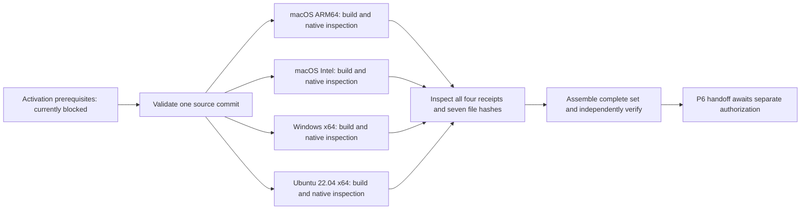

# Native candidate CI: inactive design

The [workflow example](../../packaging/native-candidate.yml.example) describes
orchestration for one complete unsigned candidate. It is outside
`.github/workflows`, and its first job always fails. No workflow was enabled or
run, and no remote execution, artifact transfer, tag or release is authorized.
The existing CI and Release workflows were not changed. They do not establish
that this new four-target path works.

The local build wrappers remain the primary interface. CI would call the same
`build-release.sh` or `build-release.ps1` used locally, then the
`assemble_candidate.py assemble` and `verify` commands. It must not duplicate
Tauri flags, invent a separate artifact list, or drop a failed matrix row.

Native format checks run inside each build wrapper on its appropriate host.
The later `inspect-artifacts` job uses the assembler's read-only collector to
check the complete transfer, matching source identities and recorded native
inspection assertions. It also binds the source commit to the workflow commit.
It does not repeat `hdiutil`, installer-policy inspection or platform tools on
a generic fan-in host. Assembly repeats content checks before writing a new
directory; `verify` then checks that complete directory separately.

## Activation prerequisites

The unconditional stop must only be replaced by a reviewed preflight in a
separately authorized change. Moving this example, removing `exit 1`, setting a
repository variable, or assigning a runner label is not sufficient approval or
evidence of readiness. The preflight implementation does not exist yet.

Activation also needs a reviewed post-checkout provisioning step in each job.
Checkout cleaning can remove ignored `node_modules` and target/helper files;
preparing those directories once on a persistent runner is insufficient. The
future step must restore exact reviewed offline inputs into the fresh workspace
and verify them before use. This example deliberately supplies no acquisition
or unreviewed provisioning command.

| Required review | Concrete condition before activation |
| --- | --- |
| Remote work | Explicit authorization to enable and run the workflow and transfer its bounded output; no release authority is implied |
| Runner images | Dedicated, disposable, unprivileged build environments with recorded OS/image/SDK/tool identities and fresh per-run directories; no developer home directories or mounted user AWS/signing material |
| Native hosts | macOS 15+ with both declared architecture toolchains; Windows 11 x64 with the MSVC/SDK toolchain; Ubuntu 22.04 x64 with the declared GTK/WebKit build baseline |
| Test inputs | Exact Rust/tool pins, crate inputs, Node 22, npm 10.9.8, lock-matching installed Playwright dependencies and a reviewed installed Chromium; no install commands in the job |
| Dependency review | Reviewed source dependency/license evidence and offline advisory inputs with recorded age and policy; stale or absent databases must not silently count as a fresh vulnerability review |
| Native helpers | Reviewed per-target inventory and all bytes at the exact absolute Cargo target `.tauri` route; no real approved inventory is currently shipped |
| Tool execution | Reviewed hashes/provenance for all native tools, archive inspectors and nested helpers, with separately enforced network denial during build/test/inspection |
| Actions and caches | Review the existing pinned action SHAs for the eventual runner Node runtime; confirm exact cache isolation, trusted producers and no cache mutation during verification/build |
| Installer evidence | Decide restricted retention/reinspection policy for the generated NSIS script and inspect actual installer output before accepting that target |

Runner labels beginning `p4-unconfigured-` are placeholders, not known machines.
`P4_HELPER_INVENTORY` would be an absolute path provisioned by the runner owner,
not a workflow input or secret. `P4_RUNNER_IMAGE_DIGEST` and
`P4_HELPER_INVENTORY_DIGEST` would be reviewed non-personal cache identifiers;
they are currently unset assumptions. A future preflight must check them
against actual runner/tool evidence, rather than accepting arbitrary strings.

Workflow checkout, action resolution, cache transfer and artifact transfer
necessarily use the CI service's network. “Offline” here applies to subprocesses
performing validation/build/inspection in a separately enforced environment;
it is not a claim that the entire CI job has no network. The example does not
provide that isolation. Cargo `--offline` does not stop Tauri, NSIS, linuxdeploy
or their children from attempting network access. Read the
[native helper contract](native-helper-cache.md) before implementing activation.

## Source validation and cache policy

Every job checks out the exact workflow commit with persisted Git credentials
disabled. The wrapper requires a clean source tree, exports that tracked commit
to a new build source directory, records lock/tool/config hashes and verifies
the source identity again after inspection. Repository permissions stay
`contents: read`; the example has no account credentials, signing inputs,
release API calls or tag operations. Its only future uploads are candidate
files and their bounded build manifests, with 14-day service retention.

Validation replays release/version/privacy/IPC and packaging checks, Python
helper tests, Node tests, browser mock-mode tests, Rust tests, formatting and
all-target Clippy. These preserve the accepted P1 trust boundaries, P2 state
and recovery behavior and P3 scheduler/query/cache/CLI/audit/table contracts.
The [P3 exit evidence](../roadmap/p3-exit-evidence.md) records the earlier local
results and measurement limits. Its counts and timing values are historical
evidence, not a substitute for passing the candidate's current tests. Synthetic
browser tests are not native application launch or hardware validation.

Cache keys include host OS/architecture, target triple, reviewed image/helper
identities and the exact lock/tool/config inputs. There are no broad fallback
restore keys or cross-OS archives. Only Cargo registry inputs are cached;
compiled outputs, native helper executables, home configuration and credentials
are excluded. A cache hit is not provenance approval. Missing dependencies or
tools remain a preprovisioning failure; the job must not acquire replacements.

Matrix `fail-fast: false` retains each target's outcome. Every fan-in uses normal
successful dependency semantics, with no `always()` or `continue-on-error`
bypass. A partial build cannot reach candidate upload. The four matrix rows and
seven distributables come from [targets.json](../../packaging/targets.json).

## Evidence that remains local or pending

Successful assembly produces seven distributables, four target manifests,
`candidate-manifest.json` and `SHA256SUMS`. The last file covers the other
twelve files. These unsigned records establish consistency relative to the
recorded build reports. They do not authenticate a publisher, prove an honest
runner, establish reproducibility or repeat native inspection.

Windows policy inspection currently requires
`target/<triple>/release/nsis/x64/installer.nsi` on its original build host. The
manifest records its digest; the candidate does not carry the script. A digest
cannot reconstruct it. Keep any necessary raw script/compiler evidence in
restricted, reviewed retention: generated scripts and logs can include local
absolute paths. This example deliberately does not upload them. A later
independent installer-policy review requires that original evidence or a new
controlled build; the assembled candidate alone cannot provide it.

No P4 native build, inspection, remote run or repeat-build result is established
by this template or its static test. Runner and helper availability remain open.
P6 still needs the actual operating systems and the installation, first launch,
runtime acquisition, data persistence, upgrade and uninstall journeys. Target
rows retain their existing status until the corresponding evidence exists.
