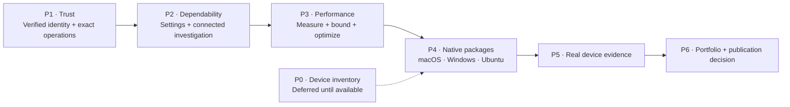

# Cloud Burrito execution roadmap

Status: **P1 and P2 complete locally. P3-01–08 complete locally; P4-01 complete, P4-02 is next. P4 and device evidence remain open.** Original source baseline: `0.2.9`, commit `095d1ad`, reviewed 2026-09-03.

Latest completed unit: [P4-01](p4-01-evidence.md) — versioned artifact and compatibility contract. Native package/device evidence remains pending.

[P3 exit evidence](p3-exit-evidence.md) records all eight separate local work units, final checks, before/after measurements and remaining native gates.

The preceding [P2-07](p2-07-evidence.md) completes keyboard, focus and readable desktop checks. The final P2 gate passes 248 Rust, 17 Node, 94 browser and 16 Python helper cases. [P2 evidence](phase-2.md) records all seven separately committed work units: persistence, settings, first run, result state, connected investigation, honest beta controls and keyboard use. Historical [P1 evidence](phase-1.md) remains unchanged. Live AWS and native platform acceptance remain pending.

P1-03 adds explicit SSO snapshots, STS account/principal verification, frozen resource credentials, refresh/expiry checks, independent pinned contexts and configuration/auth-status guards. P1-04 hands those exact verified temporary credentials to an isolated CLI child, caps both output streams and supervises cancellation and direct-child cleanup. Cleanup failures survive a superseded context as the stable `CliCleanupFailed` UI/audit error. The P1-03 temporary CLI block is removed. Broader tile/detail ownership is now covered by P1-05; process-tree and native OS behavior remain unverified.

Executable support includes native installers and a narrow Unix absolute-Python wrapper launched through its validated native interpreter with isolated Python mode. Shell, environment-relative and batch wrappers remain unsupported. AWS CLI v2 version and publisher trust remain local-installation requirements; no version probe was run. The execution deadline is not a guaranteed cleanup-return bound: waiting for OS-confirmed exit can take longer, and a nonempty isolated directory may remain.

## Product direction

Cloud Burrito keeps an AWS investigation connected across accounts, services and evidence. The first public beta should let an engineer install the desktop app, establish a verified AWS context, inspect a failed deployment and compare accounts without reconstructing context at every step.

Keep Rust + Tauri. Improve the existing execution boundary, context correctness, daily usability and measured responsiveness. Claims about safety, speed and platform support must match the evidence recorded below.

## Canonical phases

Use **P0–P6** for work items and acceptance evidence. The presentation's five cards are summary themes; their card numbers are not execution-phase IDs.

| Phase | Outcome | Exit evidence | Planning / delivery |
| --- | --- | --- | --- |
| [P0 — Establish the truth](phase-0.md) | Scope, operation inventory, five journey contracts, baseline and early platform checks | First-party execution paths mapped; baseline and gaps recorded; Windows/Ubuntu build-and-launch attempts documented; initial support matrix frozen | Scope recorded / device and native evidence pending |
| [P1 — Build the trust boundary](phase-1.md) | Exact execution allowlist, verified active/pinned identities and stale-response protection | Forbidden actions denied before execution; mismatched identity blocks work; delayed responses cannot cross contexts | P1-01–06 complete locally / native evidence pending |
| [P2 — Make the core dependable](phase-2.md) | Coherent investigation workflow, onboarding, durable settings and explicit errors | Journey contracts pass through production paths with synthetic dependencies; unfinished controls handled honestly | Complete locally / native acceptance pending |
| [P3 — Earn the performance claim](phase-3.md) | Bounded work, cancellation, caching and repeatable measurements | Synthetic timings and resource limits recorded; native startup/memory and public performance claims remain pending | P3-01–08 complete locally / native evidence pending |
| [P4 — Produce native artifacts](phase-4.md) | Unsigned packages from the same version and commit | Checksums, artifact contents and platform instructions reviewed; package installation proven in P5 | P4-01 complete locally / native artifact evidence pending |
| P5 — Validate on real machines | Packaged release candidate tested on the available macOS, Windows and Ubuntu laptops | Required journeys and install/restart/upgrade/uninstall pass on each declared OS/architecture; no unresolved critical/high defects | Outline only / not started |
| P6 — Build the portfolio launch package | English documentation, demo, decisions and release evidence | Privacy/history and dependency review complete; independent feedback recorded; explicit publication decision | Outline only / not started |

P0 probes platform compatibility early when devices become available. Pending device evidence does not block planning or future isolated P1 source work. It does block final support claims; comparable performance measurements must precede optimization claims. P4 produces candidate packages after trust, product and performance work. P5 tests those packages; a source build or Chromium test cannot substitute for this gate.

## Beta scope

- Explicit legacy and named-session SSO profiles; named sessions retain supported SDK token renewal, while expired legacy tokens require external SSO login. Live provider validation remains pending.
- Resource and identity inspection, plus bounded Logs Insights query control. Starting/stopping a query is a separate capability with cost and cleanup implications.
- One flagship investigation: Pipeline → Build → Stack → Logs, with explicit lookup when the association is unknown.
- Inherited and pinned account/region contexts.
- An optional CLI path for the 18 reviewed resource reads, using frozen verified credentials, isolated child configuration and bounded execution. P1-04 offline checks pass; native AWS CLI v2 compatibility remains unverified.
- Existing widgets retained where they meet their release criteria; no expansion to every AWS service.

Deferred: Go/Wails rewrite, plugin SDK, full AI assistant, infrastructure mutations, signing/notarization and publisher identity. Releases remain unsigned and identity-free under [AGENTS.md](../../AGENTS.md).

## Start here

1. Start [P4-01](phase-4.md#p4-01--freeze-the-artifact-and-compatibility-contract), using the [P3 exit evidence](p3-exit-evidence.md) to freeze the unsigned artifact and compatibility contract.
2. Use the phase plans in order: [P1](phase-1.md) → [P2](phase-2.md) → [P3](phase-3.md) → [P4](phase-4.md).
3. Keep evidence against the [journey contracts](phase-0.md) and [operation inventory](aws-operation-inventory.md).
4. Resume [device checks](device-checks.md) when the laptops are available; final support and native acceptance remain conditional until then.

P1-01–03 remain in local commit `a879851`; P1-04 is `43a168c`, P1-05 is `f398f51`, and P1-06 is a separate local commit. The earlier history was not rewritten. No live AWS call, native GUI acceptance, Windows/Ubuntu validation, install, push, tag, release or GitHub action was performed. Publication remains a separate decision after the reviewable release package exists.
