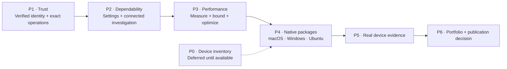

# Cloud Burrito execution roadmap

Status: **P1-01 through P1-03 complete locally. P1 remains in progress; P1-04 is next. P2–P4 remain planned. P0 device evidence remains open.** Original source baseline: `0.2.9`, commit `095d1ad`, reviewed 2026-09-03.

Current work: local P1-03 implementation is complete, with 97 Rust library tests and 5 Node production-handler tests passing. See [P1-03 evidence](p1-03-evidence.md), the historical [P1-02 evidence](p1-02-evidence.md) and [P1-01 evidence](p1-01-evidence.md), and the [execution plan](execution-plan.md). These are offline results; live AWS and native platform acceptance remain pending.

P1-03 adds explicit SSO configuration snapshots, STS account/principal verification using the same frozen credentials as resource calls, refresh and expiry checks, independent pinned contexts, configuration invalidation, and guards against older connection/auth-status outcomes. The desktop CLI currently returns `CliContextUnavailable`; P1-04 must supply verified credentials and a controlled child environment before it becomes available again. Broader tile/detail ownership remains P1-05 work.

## Product direction

Cloud Burrito keeps an AWS investigation connected across accounts, services and evidence. The first public beta should let an engineer install the desktop app, establish a verified AWS context, inspect a failed deployment and compare accounts without reconstructing context at every step.

Keep Rust + Tauri. Improve the existing execution boundary, context correctness, daily usability and measured responsiveness. Claims about safety, speed and platform support must match the evidence recorded below.

## Canonical phases

Use **P0–P6** for work items and acceptance evidence. The presentation's five cards are summary themes; their card numbers are not execution-phase IDs.

| Phase | Outcome | Exit evidence | Planning / delivery |
| --- | --- | --- | --- |
| [P0 — Establish the truth](phase-0.md) | Scope, operation inventory, five journey contracts, baseline and early platform checks | First-party execution paths mapped; baseline and gaps recorded; Windows/Ubuntu build-and-launch attempts documented; initial support matrix frozen | Scope recorded / device and native evidence pending |
| [P1 — Build the trust boundary](phase-1.md) | Exact execution allowlist, verified active/pinned identities and stale-response protection | Forbidden actions denied before execution; mismatched identity blocks work; delayed responses cannot cross contexts | P1-01–03 complete locally / P1-04 next / P1-05–06 pending |
| [P2 — Make the core dependable](phase-2.md) | Coherent investigation workflow, onboarding, durable settings and explicit errors | Journey contracts pass through production paths with synthetic dependencies; unfinished controls handled honestly | Plan complete / implementation not started |
| [P3 — Earn the performance claim](phase-3.md) | Bounded work, cancellation, caching and repeatable measurements | Startup, result latency, memory and request counts measured; published claims reproducible | Plan complete / implementation not started |
| [P4 — Produce native artifacts](phase-4.md) | Unsigned packages from the same version and commit | Checksums, artifact contents and platform instructions reviewed; package installation proven in P5 | Plan complete / implementation not started |
| P5 — Validate on real machines | Packaged release candidate tested on the available macOS, Windows and Ubuntu laptops | Required journeys and install/restart/upgrade/uninstall pass on each declared OS/architecture; no unresolved critical/high defects | Outline only / not started |
| P6 — Build the portfolio launch package | English documentation, demo, decisions and release evidence | Privacy/history and dependency review complete; independent feedback recorded; explicit publication decision | Outline only / not started |

P0 probes platform compatibility early when devices become available. Pending device evidence does not block planning or future isolated P1 source work. It does block final support claims; comparable performance measurements must precede optimization claims. P4 produces candidate packages after trust, product and performance work. P5 tests those packages; a source build or Chromium test cannot substitute for this gate.

## Beta scope

- Explicit legacy and named-session SSO profiles; named sessions retain supported SDK token renewal, while expired legacy tokens require external SSO login. Live provider validation remains pending.
- Resource and identity inspection, plus bounded Logs Insights query control. Starting/stopping a query is a separate capability with cost and cleanup implications.
- One flagship investigation: Pipeline → Build → Stack → Logs, with explicit lookup when the association is unknown.
- Inherited and pinned account/region contexts.
- An optional CLI path for explicitly supported operations and arguments after P1-04 completes verified credential handoff and process isolation; currently unavailable from the desktop command.
- Existing widgets retained where they meet their release criteria; no expansion to every AWS service.

Deferred: Go/Wails rewrite, plugin SDK, full AI assistant, infrastructure mutations, signing/notarization and publisher identity. Releases remain unsigned and identity-free under [AGENTS.md](../../AGENTS.md).

## Start here

1. Read the [P1-03 evidence](p1-03-evidence.md) and [execution plan](execution-plan.md); P1-04 is the next implementation unit.
2. Use the phase plans in order: [P1](phase-1.md) → [P2](phase-2.md) → [P3](phase-3.md) → [P4](phase-4.md).
3. Keep evidence against the [journey contracts](phase-0.md) and [operation inventory](aws-operation-inventory.md).
4. Resume [device checks](device-checks.md) when the laptops are available; final support and native acceptance remain conditional until then.

P1-01–03 include local source changes and offline checks. No live AWS call, native GUI acceptance, Windows/Ubuntu validation, install, push, tag, release or GitHub action was performed. Publication remains a separate decision after the reviewable release package exists.
